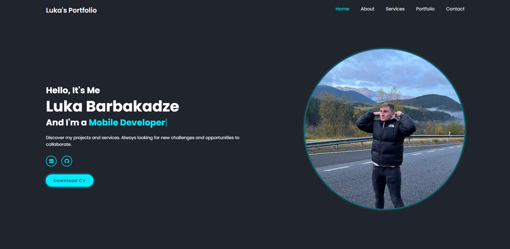

# Personal Portfolio

This is my personal portfolio, developed from scratch using **HTML, CSS, and JavaScript**.

## Features
- Modern and responsive design.
- Sections for introduction, services, projects, and contact.
- Animations and interactive effects.
- Clean and well-structured code.

## Technologies Used
- **HTML5**: Site structure.
- **CSS3**: Styles and animations.
- **JavaScript**: Interactivity and dynamism.

## Installation and Usage
1. Clone this repository:
   ```sh
   git clone https://github.com/DevLukab/portfolio.git
   ```
2. Open the `index.html` file in your browser and execute it.

## Screenshots


## Contact
If you would like to contact me, you can reach me through:
- Email: [dev.lukab@gmail.com](mailto:dev.lukab@gmail.com)
- LinkedIn: [https://www.linkedin.com/in/luka-barbakadze-78b9352b8/](https://www.linkedin.com/in/luka-barbakadze-78b9352b8/)

Thank you for visiting my portfolio! 🎨🚀
